# Actividad 3 - CRUD con FastAPI, PostgreSQL y Alembic

## 1. Descripción

Esta actividad consiste en desarrollar una API REST utilizando FastAPI y PostgreSQL, implementando operaciones CRUD para la gestión de productos y materias.

El proyecto utiliza una arquitectura organizada por capas para separar las responsabilidades de la aplicación. La comunicación con PostgreSQL se realiza mediante SQLAlchemy y las modificaciones de la estructura de la base de datos se gestionan mediante Alembic.

Además, el proyecto se ejecuta mediante Docker Compose, utilizando contenedores independientes para FastAPI, PostgreSQL y pgAdmin.

## 2. Tecnologías utilizadas

- Python 3.11
- FastAPI
- Uvicorn
- PostgreSQL 16
- SQLAlchemy
- Psycopg
- Alembic
- Docker
- Docker Compose
- pgAdmin 4

## 3. Arquitectura del proyecto

El backend utiliza una arquitectura por capas para separar las responsabilidades de cada componente.

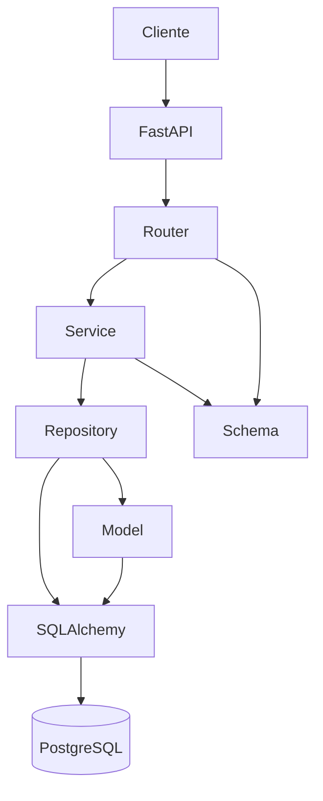

### Flujo de una solicitud

```text
Cliente
   |
   v
FastAPI
   |
   v
Router
   |
   v
Service
   |
   v
Repository
   |
   v
SQLAlchemy
   |
   v
PostgreSQL
```

### Responsabilidades por capa

| Capa | Responsabilidad |
|---|---|
| `routers` | Define los endpoints HTTP y recibe las solicitudes |
| `services` | Contiene la lógica de negocio |
| `repositories` | Gestiona el acceso y las operaciones sobre los datos |
| `models` | Define las tablas mediante modelos SQLAlchemy |
| `schemas` | Define los datos de entrada y salida de la API |
| `database` | Configura la conexión con PostgreSQL |
| `alembic` | Gestiona las migraciones de la base de datos |

## 4. Estructura del proyecto

```text
actividad3_david_morales/
│
├── alembic/
│   ├── versions/
│   │   ├── 36447967745f_crear_tabla_productos.py
│   │   └── 9163137d84dd_crear_tabla_materias.py
│   ├── env.py
│   ├── README
│   └── script.py.mako
│
├── database/
│   ├── database.py
│   └── __init__.py
│
├── evidencias/
│
├── models/
│   ├── materia.py
│   ├── producto.py
│   └── __init__.py
│
├── repositories/
│   ├── materia_repository.py
│   ├── producto_repository.py
│   └── __init__.py
│
├── routers/
│   ├── materias.py
│   ├── productos.py
│   └── __init__.py
│
├── schemas/
│   ├── materia.py
│   ├── producto.py
│   └── __init__.py
│
├── services/
│   ├── materia_service.py
│   ├── producto_service.py
│   └── __init__.py
│
├── .dockerignore
├── .env.example
├── .gitignore
├── alembic.ini
├── compose.yaml
├── Dockerfile
├── main.py
├── README.md
└── requirements.txt
```

## 5. Base de datos

La aplicación utiliza PostgreSQL como sistema gestor de base de datos.

La base de datos utilizada es:

```text
actividad3
```

Dentro de la base de datos se encuentran las tablas utilizadas por la aplicación:

```text
productos
materias
alembic_version
```

La tabla `alembic_version` es utilizada por Alembic para controlar la versión actual de las migraciones.

### 5.1 Tabla `productos`

La tabla `productos` contiene los siguientes campos:

| Campo | Tipo | Descripción |
|---|---|---|
| `id` | Integer | Identificador único del producto |
| `nombre` | String | Nombre del producto |
| `descripcion` | String | Descripción del producto |
| `precio` | Float | Precio del producto |
| `stock` | Integer | Cantidad disponible |

### 5.2 Tabla `materias`

La tabla `materias` contiene los siguientes campos:

| Campo | Tipo | Descripción |
|---|---|---|
| `id` | Integer | Identificador único de la materia |
| `nombre` | String | Nombre de la materia |

La tabla fue creada mediante una migración de Alembic y posteriormente fue utilizada para realizar las operaciones CRUD.

## 6. Migraciones con Alembic

Alembic se utiliza para controlar la evolución de la estructura de la base de datos.

Las migraciones utilizadas en el proyecto son:

```text
36447967745f_crear_tabla_productos.py
9163137d84dd_crear_tabla_materias.py
```

La primera migración crea la tabla `productos`.

La segunda migración crea la tabla `materias`.

Para aplicar todas las migraciones:

```bash
alembic upgrade head
```

Para consultar la migración actual:

```bash
alembic current
```

Para verificar si existen cambios pendientes:

```bash
alembic check
```

La validación realizada devolvió:

```text
No new upgrade operations detected.
```

Esto indica que no existen nuevas operaciones de migración pendientes.
# 7. Ejecución con Docker

El proyecto utiliza Docker Compose para ejecutar los servicios necesarios.

Los servicios utilizados son:

| Servicio | Contenedor | Puerto |
|---|---|---|
| FastAPI | `fastapi-api-actividad3` | `8000` |
| PostgreSQL | `postgres-actividad3` | `5432` |
| pgAdmin | `pgadmin-actividad3` | `5050` |

### Arquitectura de los contenedores

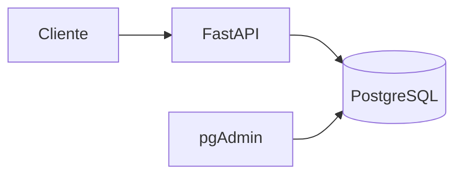

### 7.1 Construir e iniciar el proyecto

```bash
docker compose up -d --build
```

### 7.2 Consultar los contenedores

```bash
docker compose ps
```

### 7.3 Detener los servicios

```bash
docker compose stop
```

### 7.4 Iniciar nuevamente los servicios

```bash
docker compose start
```

# 8. Documentación de la API

FastAPI proporciona una documentación interactiva mediante Swagger UI.

Con los contenedores funcionando, la documentación se encuentra disponible en:

```text
http://localhost:8000/docs
```

Desde esta interfaz es posible consultar y ejecutar directamente los endpoints de la API.

La documentación organiza los endpoints en los grupos:

- `default`
- `Productos`
- `Materias`

La sección `Productos` contiene las operaciones CRUD correspondientes y el endpoint adicional de productos disponibles.

La sección `Materias` contiene las operaciones CRUD implementadas para este recurso.

# 9. Endpoints de productos

El recurso `productos` cuenta con las siguientes operaciones:

| Método | Endpoint | Descripción |
|---|---|---|
| `POST` | `/productos` | Crear producto |
| `GET` | `/productos` | Obtener todos los productos |
| `GET` | `/productos/disponibles` | Obtener productos con stock disponible |
| `GET` | `/productos/{producto_id}` | Obtener producto por ID |
| `PUT` | `/productos/{producto_id}` | Actualizar producto |
| `DELETE` | `/productos/{producto_id}` | Eliminar producto |

## 9.1 Consulta de productos disponibles

Como parte del reto adicional se implementó:

```text
GET /productos/disponibles
```

Este endpoint devuelve únicamente los productos cuyo stock es mayor que cero.

La condición utilizada para esta consulta es:

```text
stock > 0
```

# 10. Endpoints de materias

El recurso `materias` cuenta con un CRUD completo:

| Método | Endpoint | Descripción |
|---|---|---|
| `POST` | `/materias` | Crear materia |
| `GET` | `/materias` | Obtener todas las materias |
| `GET` | `/materias/{materia_id}` | Obtener una materia por ID |
| `PUT` | `/materias/{materia_id}` | Actualizar una materia |
| `DELETE` | `/materias/{materia_id}` | Eliminar una materia |

# 11. Pruebas del CRUD de materias

Para comprobar el funcionamiento del CRUD se realizaron operaciones reales mediante Swagger UI.

El flujo de pruebas fue:

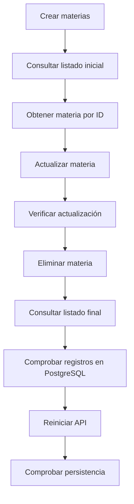

## 11.1 Crear materias

Se utilizaron solicitudes `POST` para crear tres registros de materias.

.png>)

## 11.2 Listado inicial

Después de crear los registros se realizó una consulta mediante:

```text
GET /materias
```

La respuesta permitió comprobar que los registros habían sido almacenados correctamente.

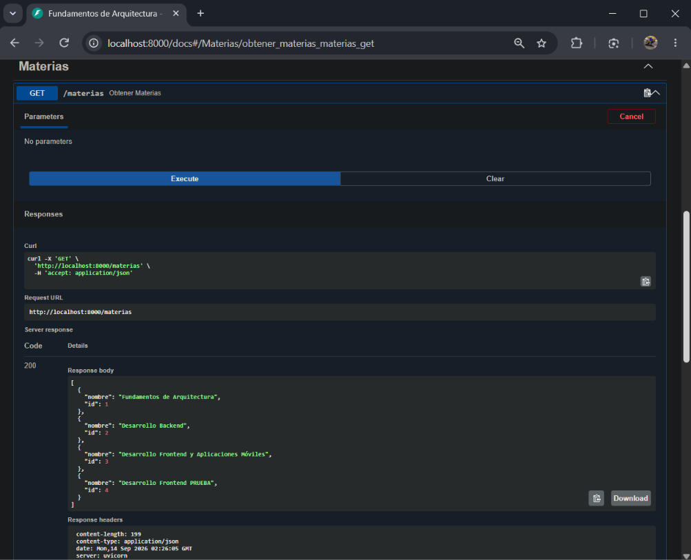

## 11.3 Obtener materia por ID

Se realizó una consulta mediante:

```text
GET /materias/{materia_id}
```

Para la prueba se utilizó el ID `4`.

La respuesta permitió recuperar la materia correspondiente al identificador indicado.

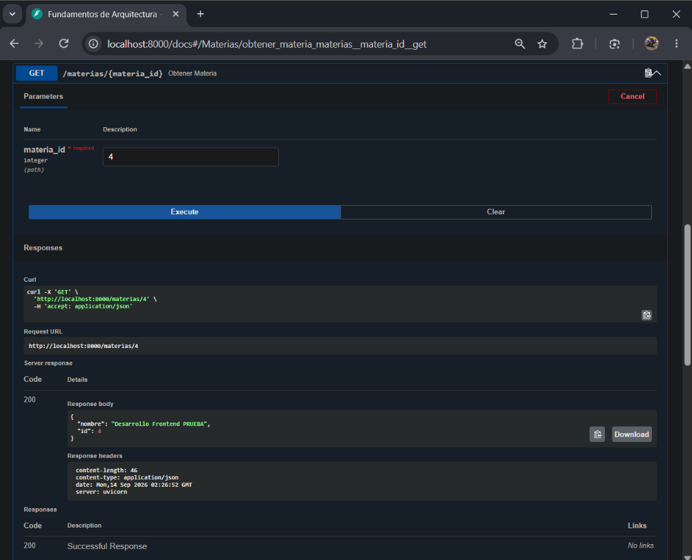

## 11.4 Actualizar materia

Se realizó una modificación mediante:

```text
PUT /materias/{materia_id}
```

En la prueba se actualizó el registro con ID `4`.

La respuesta HTTP fue `200`, indicando que la operación se realizó correctamente.

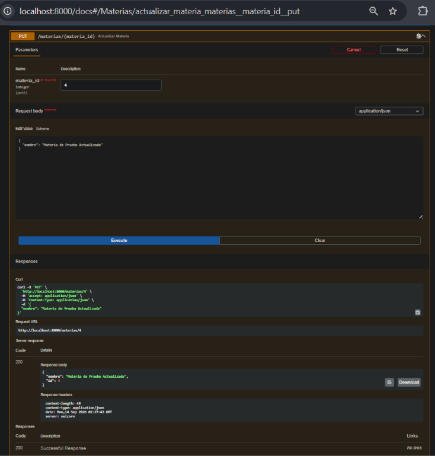

## 11.5 Verificar actualización

Después de realizar la actualización se ejecutó nuevamente:

```text
GET /materias/{materia_id}
```

La respuesta permitió comprobar que el nuevo nombre quedó almacenado correctamente.

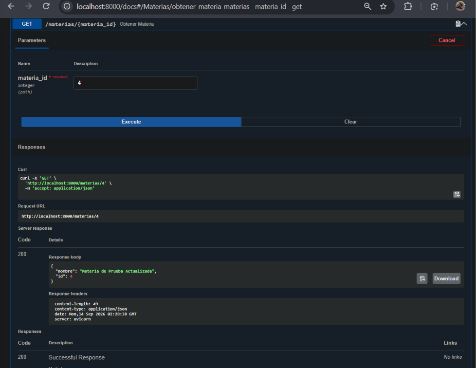

## 11.6 Eliminar materia

Posteriormente se ejecutó:

```text
DELETE /materias/{materia_id}
```

La API respondió correctamente indicando que la materia fue eliminada.

La respuesta obtenida fue:

```json
{
    "mensaje": "Materia eliminada correctamente"
}
```

La operación devolvió código HTTP `200`.

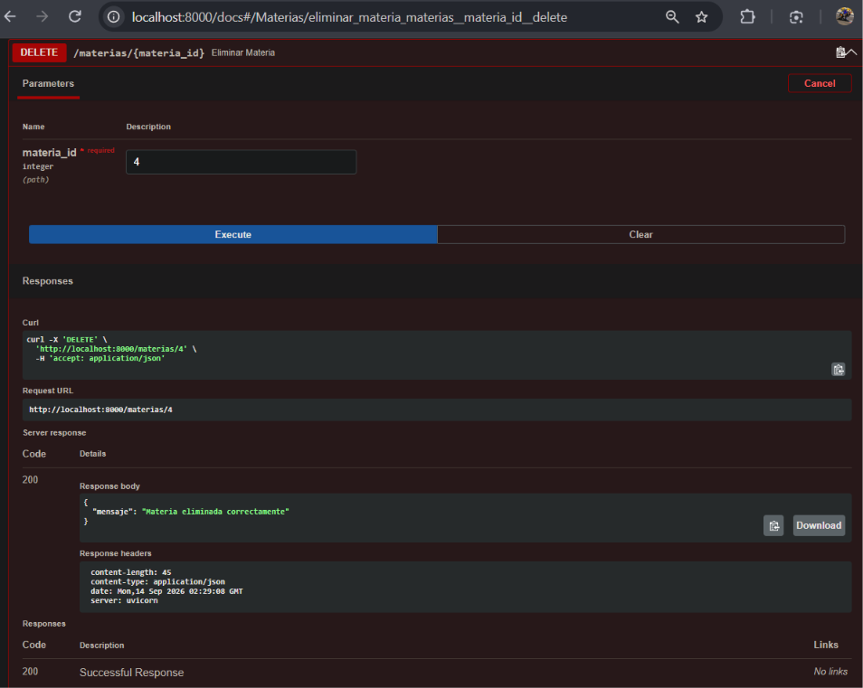

## 11.7 Listado final

Después de eliminar el registro de prueba se ejecutó nuevamente:

```text
GET /materias
```

El resultado permitió comprobar que la materia eliminada ya no aparecía en el listado.

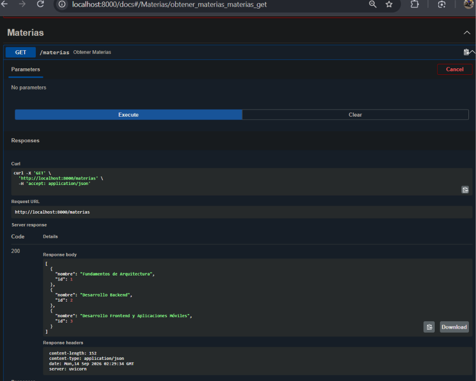
# 12. Evidencias en PostgreSQL

Además de las pruebas realizadas mediante Swagger UI, se realizaron comprobaciones directamente sobre PostgreSQL utilizando pgAdmin.

## 12.1 Tabla `materias`

La tabla `materias` se encuentra creada dentro del esquema `public` de la base de datos `actividad3`.

.png>)

## 12.2 Registros almacenados

Para comprobar directamente los registros almacenados se utilizó la consulta:

```sql
SELECT *
FROM public.materias
ORDER BY id ASC;
```

El resultado permitió verificar los registros existentes directamente desde PostgreSQL.

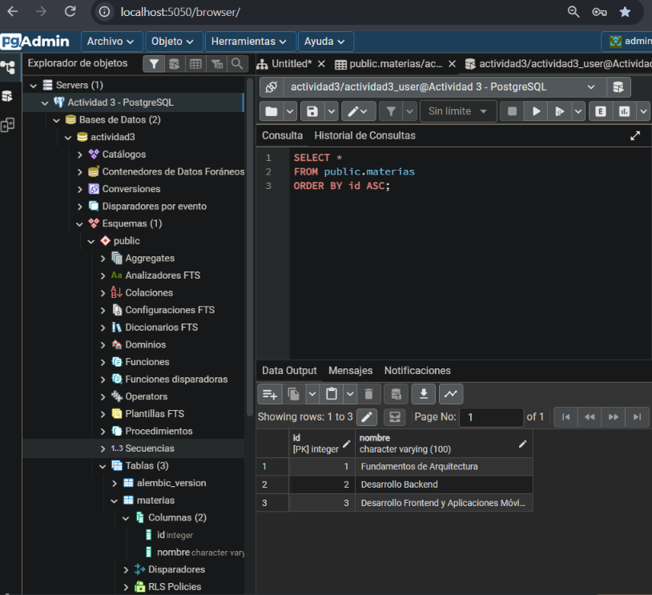

# 13. Prueba de persistencia

Para comprobar la persistencia de los datos se detuvo y posteriormente se inició nuevamente el contenedor de FastAPI.

Primero:

```bash
docker compose stop api
```

Después:

```bash
docker compose start api
```

Una vez iniciado nuevamente el servicio se realizó otra consulta:

```text
GET /materias
```

Los registros continuaron disponibles después de reiniciar el servicio.

Esto demuestra que la información permanece almacenada en PostgreSQL y no depende únicamente de la ejecución actual de FastAPI.

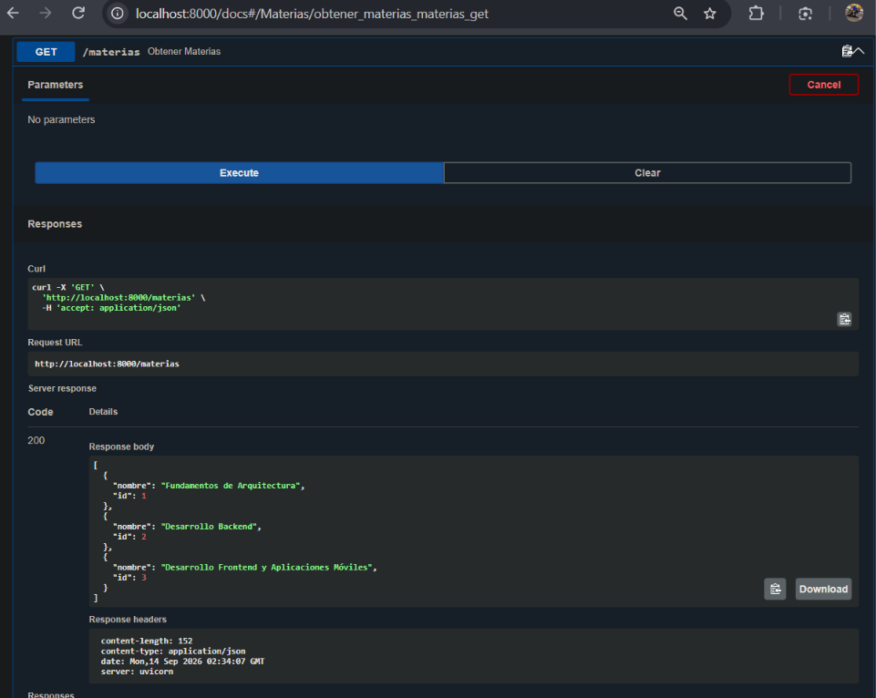

# 14. Validaciones realizadas

Durante el desarrollo y las pruebas del proyecto se verificaron los siguientes puntos:

- FastAPI inicia correctamente.
- Swagger UI funciona correctamente.
- PostgreSQL funciona como sistema gestor de base de datos.
- pgAdmin permite consultar la base de datos.
- Docker Compose inicia los servicios necesarios.
- La aplicación puede conectarse con PostgreSQL.
- Alembic aplica correctamente las migraciones.
- La tabla `productos` existe en la base de datos.
- La tabla `materias` existe en la base de datos.
- El CRUD de productos funciona.
- El endpoint `/productos/disponibles` funciona.
- El CRUD de materias funciona.
- Las materias pueden crearse correctamente.
- Las materias pueden consultarse mediante listado.
- Las materias pueden consultarse mediante su ID.
- Las materias pueden actualizarse.
- Las materias pueden eliminarse.
- Los cambios realizados mediante la API se reflejan en PostgreSQL.
- Los registros permanecen después de reiniciar el servicio.

# 15. Variables de entorno

Las configuraciones sensibles se manejan mediante variables de entorno.

El archivo `.env` se utiliza localmente para configurar los parámetros de conexión y ejecución.

Entre las variables utilizadas se encuentran:

```text
APP_PORT
DB_USER
DB_PASSWORD
DB_HOST
DB_PORT
DB_NAME
POSTGRES_USER
POSTGRES_PASSWORD
POSTGRES_DB
PGADMIN_EMAIL
PGADMIN_PASSWORD
```

El archivo `.env` no se incluye en el repositorio.

En su lugar se proporciona:

```text
.env.example
```

Este archivo sirve como referencia para configurar el entorno local sin publicar credenciales.

# 16. Organización del código

La aplicación se encuentra separada en diferentes módulos para evitar concentrar toda la lógica en un solo archivo.

```text
routers
   |
   v
services
   |
   v
repositories
   |
   v
models
   |
   v
database
```

Los `schemas` se utilizan para validar y estructurar los datos recibidos y enviados por la API.

Esta separación permite mantener responsabilidades independientes y facilita el mantenimiento y ampliación del proyecto.

# 17. Flujo general de la aplicación

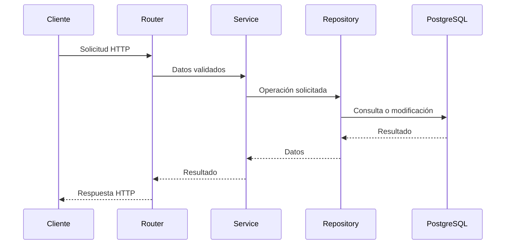

Este flujo representa la forma en que una solicitud atraviesa las diferentes capas de la aplicación.

# 18. Evidencias del proyecto

Las evidencias se encuentran organizadas dentro de la carpeta:

```text
evidencias/
```

Las capturas documentan las principales pruebas realizadas:

| Evidencia | Descripción |
|---|---|
| `POST → crear 3 materias(1).png` | Creación de materias mediante POST |
| `materias-listado-inicial.png` | Listado inicial de materias |
| `materia-obtener-por-id.png` | Consulta de una materia mediante ID |
| `materia-actualizar.png` | Actualización de una materia |
| `materia-verificar-actualizacion.png` | Verificación del cambio realizado |
| `materia-eliminar.png` | Eliminación de una materia |
| `materias-listado-final.png` | Listado después de eliminar el registro de prueba |
| `materias-tabla-postgresql(1).png` | Evidencia de la tabla en PostgreSQL |
| `materias-registros-finales.png` | Consulta de registros directamente en PostgreSQL |
| `materias-persistencia.png` | Comprobación de persistencia después de reiniciar la API |

# 19. Resultado

El proyecto cuenta con una API REST funcional desarrollada con FastAPI y conectada a PostgreSQL.

Se implementaron operaciones CRUD para los recursos:

```text
productos
materias
```

También se implementó el reto adicional:

```text
GET /productos/disponibles
```

La estructura del proyecto se organizó mediante capas de:

```text
routers
services
repositories
models
schemas
database
```

La estructura de la base de datos se controla mediante Alembic y la aplicación se ejecuta mediante Docker Compose.

Las pruebas realizadas mediante Swagger UI y pgAdmin permitieron comprobar el funcionamiento de las operaciones y la persistencia de la información.

# 20. Conclusión

El desarrollo de esta actividad permitió integrar diferentes componentes necesarios para construir un backend organizado y funcional.

FastAPI permitió crear y documentar los endpoints de la API, mientras que PostgreSQL se utilizó para almacenar de manera persistente la información. SQLAlchemy permitió establecer la comunicación entre los modelos de la aplicación y la base de datos, y Alembic permitió controlar la creación y evolución de las tablas mediante migraciones.

La organización por capas permitió separar las responsabilidades del sistema. Los routers se encargan de recibir las solicitudes HTTP, los services concentran la lógica de la aplicación, los repositories gestionan el acceso a los datos, los models representan las tablas de PostgreSQL y los schemas controlan la estructura de los datos que entran y salen de la API.

Docker Compose permitió integrar el backend, la base de datos y pgAdmin dentro de un mismo entorno de ejecución, facilitando la configuración y reproducción del proyecto.

Finalmente, las pruebas realizadas mediante Swagger UI y pgAdmin permitieron comprobar las operaciones CRUD, verificar los cambios directamente en PostgreSQL y demostrar que los datos permanecen almacenados después de reiniciar el servicio.

Con esto se obtuvo un backend funcional, organizado y preparado para futuras ampliaciones.